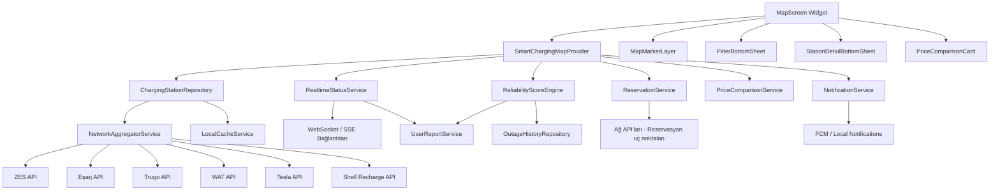
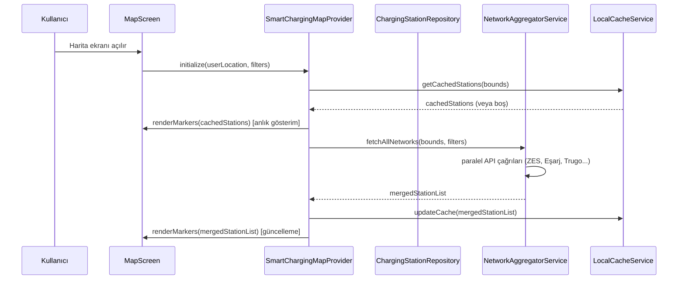
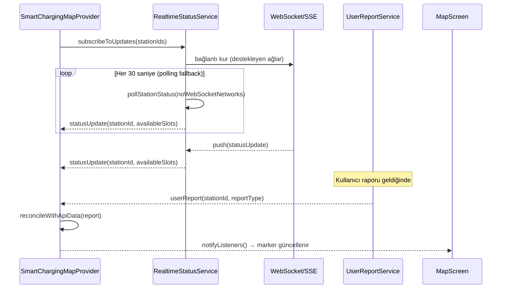
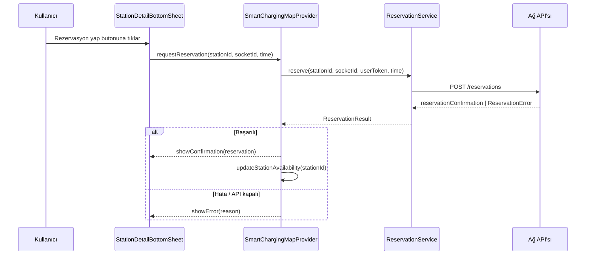
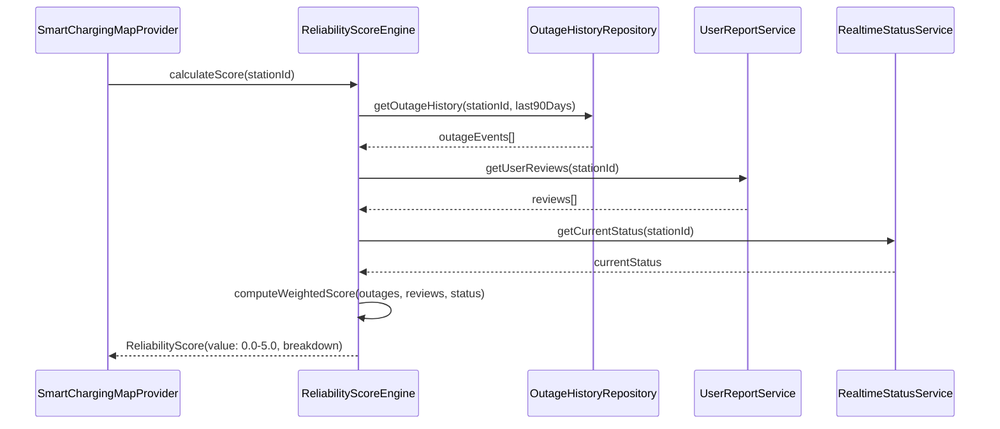

# Tasarım Dokümanı: Akıllı Şarj Haritası

## Genel Bakış

Akıllı Şarj Haritası, mevcut `MapScreen`'in üzerine inşa edilen kapsamlı bir modüldür. Türkiye'deki tüm büyük şarj ağlarını (ZES, Eşarj, Trugo, WAT, Tesla, Shell Recharge) tek bir harita üzerinde birleştiren; gerçek zamanlı doluluk durumu, istasyon güvenilirlik puanı, soket tipi filtreleme, rezervasyon entegrasyonu, arıza bildirimleri ve güzergah bazlı fiyat karşılaştırması sunan bir Flutter modülüdür.

Mevcut `MapScreen`, statik mock veri ve placeholder harita içermektedir. Bu geliştirme; Provider state management mimarisi korunarak, gerçek zamanlı API entegrasyonu, zengin UI katmanları ve offline-tolerant bir veri katmanı ekleyecektir.

---

## Mimari



---

## Sıralı Akış Diyagramları

### 1. Harita Başlatma ve İstasyon Yükleme



### 2. Gerçek Zamanlı Doluluk Durumu



### 3. Rezervasyon Akışı



### 4. Güvenilirlik Puanı Hesaplama



---

## Bileşenler ve Arayüzler

### 1. SmartChargingMapProvider

**Amaç**: Harita ekranının tüm state yönetimi; istasyon listesi, filtreler, seçili istasyon, gerçek zamanlı güncellemeler ve bildirimler.

**Arayüz**:

```dart
class SmartChargingMapProvider extends ChangeNotifier {
  // State
  List<ChargingStation> get stations;
  ChargingStation? get selectedStation;
  StationFilters get activeFilters;
  LoadingState get loadingState;
  MapBounds? get currentBounds;

  // Komutlar
  Future<void> initialize(LatLng userLocation);
  Future<void> loadStationsInBounds(MapBounds bounds);
  Future<void> applyFilters(StationFilters filters);
  void selectStation(String stationId);
  void clearSelection();
  Future<void> refreshStationStatus(String stationId);
  Future<ReservationResult> makeReservation(ReservationRequest request);
  Future<List<PriceOption>> getRouteBasedPrices(List<String> stationIds);
  void submitUserReport(UserStationReport report);
  Future<void> requestNotificationForStation(String stationId);
}
```

**Sorumluluklar**:
- Tüm alt servislerden gelen veriyi birleştirmek
- UI'ın tükettiği tek doğruluk kaynağı olmak
- Kullanıcı raporlarıyla API verilerini uzlaştırmak

---

### 2. ChargingStationRepository

**Amaç**: Ağ ve önbellek kaynaklarından istasyon verisini soyutlar; yalnız bir veri modeli döner.

**Arayüz**:

```dart
abstract class ChargingStationRepository {
  Future<List<ChargingStation>> getStationsInBounds(
    MapBounds bounds,
    StationFilters filters,
  );
  Future<ChargingStation> getStationDetails(String stationId);
  Future<List<ChargingStation>> searchStations(String query);
  Stream<StationStatusUpdate> watchStationStatus(List<String> stationIds);
}

class ChargingStationRepositoryImpl implements ChargingStationRepository {
  final NetworkAggregatorService _networkAggregator;
  final LocalCacheService _cache;
  // ...
}
```

---

### 3. NetworkAggregatorService

**Amaç**: Tüm şarj ağı API'larını tek bir birleşik liste olarak sunar; hata yönetimi ve veri normalizasyonu burada yapılır.

**Arayüz**:

```dart
class NetworkAggregatorService {
  final List<ChargingNetworkAdapter> _adapters;

  Future<List<ChargingStation>> fetchAll(
    MapBounds bounds,
    StationFilters filters,
  );

  // Her ağ adaptörü için sözleşme
}

abstract class ChargingNetworkAdapter {
  NetworkType get networkType;
  bool get supportsReservation;
  bool get supportsRealtimeStatus;

  Future<List<ChargingStation>> fetchStations(MapBounds bounds);
  Future<StationStatus> fetchStatus(String stationId);
  Future<ReservationResult> reserve(ReservationRequest request);
}
```

**Ağ Adaptörleri**:
- `ZesNetworkAdapter`
- `EsarjNetworkAdapter`
- `TrugoNetworkAdapter`
- `WatNetworkAdapter`
- `TeslaNetworkAdapter`
- `ShellRechargeNetworkAdapter`

---

### 4. ReliabilityScoreEngine

**Amaç**: Çeşitli sinyallerden bileşik bir güvenilirlik puanı üretir.

**Arayüz**:

```dart
class ReliabilityScoreEngine {
  Future<ReliabilityScore> calculateScore(String stationId);

  // Ağırlıklar: bozulma geçmişi %40, kullanıcı yorumları %35, anlık durum %25
  double _computeWeightedScore({
    required List<OutageEvent> outageHistory,
    required List<UserReview> reviews,
    required StationStatus currentStatus,
  });
}
```

---

### 5. ReservationService

**Amaç**: Destekleyen ağlar için slot rezervasyonu yapar; API yoksa zarif biçimde kapanır.

**Arayüz**:

```dart
class ReservationService {
  Future<ReservationResult> reserve(ReservationRequest request);
  Future<bool> cancelReservation(String reservationId);
  Future<List<Reservation>> getUserReservations();
  bool isReservationSupported(NetworkType networkType);
}
```

---

### 6. NotificationService

**Amaç**: Arıza/kapatma bildirimlerini ve rezervasyon hatırlatmalarını yönetir.

**Arayüz**:

```dart
class NotificationService {
  Future<void> subscribeToStation(String stationId);
  Future<void> unsubscribeFromStation(String stationId);
  Future<void> scheduleReservationReminder(Reservation reservation);
  void handleIncomingNotification(RemoteMessage message);
}
```

---

## Veri Modelleri

### ChargingStation

```dart
class ChargingStation {
  final String id;
  final String name;
  final NetworkType networkType;
  final LatLng location;
  final String address;
  final List<ChargingSocket> sockets;
  final StationStatus status;           // available | busy | offline | unknown
  final ReliabilityScore reliabilityScore;
  final double? pricePerKwh;
  final bool supportsReservation;
  final DateTime lastUpdated;
}
```

**Doğrulama Kuralları**:
- `id` boş olamaz
- `location` geçerli koordinat aralığında olmalı (lat: -90..90, lng: -180..180)
- `sockets` en az bir eleman içermeli
- `pricePerKwh` null değilse 0'dan büyük olmalı

---

### ChargingSocket

```dart
class ChargingSocket {
  final String socketId;
  final SocketType socketType;   // ccs2 | chademo | acType2 | tesla | acType1
  final double powerKw;
  final SocketStatus status;     // available | occupied | faulted | unknown
  final bool isReservable;
}
```

---

### StationFilters

```dart
class StationFilters {
  final Set<NetworkType> networks;           // boş = tümü
  final Set<SocketType> socketTypes;         // boş = tümü
  final double? minPowerKw;
  final double? maxPricePerKwh;
  final double? minReliabilityScore;         // 0.0 - 5.0
  final bool onlyAvailable;
  final bool onlyReservable;

  StationFilters copyWith({...});
  static StationFilters get empty;
}
```

---

### ReliabilityScore

```dart
class ReliabilityScore {
  final double value;             // 0.0 - 5.0
  final double outageComponent;  // 0.0 - 1.0 (ağırlık: %40)
  final double reviewComponent;  // 0.0 - 1.0 (ağırlık: %35)
  final double statusComponent;  // 0.0 - 1.0 (ağırlık: %25)
  final int sampleSize;
  final DateTime calculatedAt;
}
```

---

### ReservationRequest / ReservationResult

```dart
class ReservationRequest {
  final String stationId;
  final String socketId;
  final DateTime startTime;
  final Duration duration;
  final String userToken;
}

sealed class ReservationResult {
  // İki alt tip:
}

class ReservationSuccess extends ReservationResult {
  final String reservationId;
  final DateTime confirmedStartTime;
  final DateTime expiresAt;
}

class ReservationFailure extends ReservationResult {
  final ReservationErrorType errorType;  // notSupported | slotTaken | authError | networkError
  final String message;
}
```

---

### UserStationReport

```dart
class UserStationReport {
  final String stationId;
  final String socketId;
  final UserReportType reportType;  // working | faulty | offline | priceWrong
  final String? comment;
  final DateTime reportedAt;
  final String reporterId;
}
```

---

## Algoritmik Sözde Kod

### Ana Veri Yükleme Algoritması

```pascal
ALGORITHM loadStationsInBounds(bounds, filters)
INPUT:  bounds: MapBounds, filters: StationFilters
OUTPUT: mergedStations: List<ChargingStation>

BEGIN
  // Önce önbellekten anlık gösterim
  cachedStations ← cache.get(bounds, filters)
  IF cachedStations IS NOT EMPTY THEN
    notifyUI(cachedStations)
  END IF

  // Tüm ağ adaptörlerini paralel çalıştır
  results ← []
  errors  ← []

  PARALLEL FOR EACH adapter IN enabledAdapters DO
    TRY
      stations ← adapter.fetchStations(bounds)
      normalizedStations ← normalize(stations, adapter.networkType)
      results.addAll(normalizedStations)
    CATCH NetworkError AS e
      errors.add(AdapterError(adapter.networkType, e))
    END TRY
  END PARALLEL FOR

  // En az bir ağdan veri geldiyse devam et
  ASSERT results.length > 0 OR cachedStations.length > 0

  merged ← deduplicateByLocation(results)
  filtered ← applyFilters(merged, filters)

  cache.update(bounds, filters, filtered)
  notifyUI(filtered)

  IF errors IS NOT EMPTY THEN
    notifyUI(PartialLoadWarning(failedNetworks: errors))
  END IF

  RETURN filtered
END
```

**Önkoşullar**:
- `bounds` geçerli ve null değil
- `filters` geçerli StationFilters nesnesi

**Sonkoşullar**:
- Dönen liste yalnızca `filters` koşullarını sağlayan istasyonları içerir
- Aynı fiziksel istasyondan gelen çift kayıtlar tekilleştirilmiş olur
- En az bir adaptör hata verirse kısmi uyarı bildirilir

---

### Güvenilirlik Puanı Hesaplama Algoritması

```pascal
ALGORITHM computeWeightedScore(outageHistory, reviews, currentStatus)
INPUT:  outageHistory: List<OutageEvent> (son 90 gün)
        reviews: List<UserReview>
        currentStatus: StationStatus
OUTPUT: score: double (0.0 - 5.0)

BEGIN
  // Bozulma bileşeni (ağırlık %40)
  outageCount ← outageHistory.length
  IF outageCount = 0 THEN
    outageComponent ← 1.0
  ELSE IF outageCount <= 2 THEN
    outageComponent ← 0.7
  ELSE IF outageCount <= 5 THEN
    outageComponent ← 0.4
  ELSE
    outageComponent ← 0.1
  END IF

  // Kullanıcı yorumu bileşeni (ağırlık %35)
  IF reviews.length = 0 THEN
    reviewComponent ← 0.5  // bilinmiyor; nötr
  ELSE
    positiveCount ← reviews.count(r => r.reportType = "working")
    reviewComponent ← positiveCount / reviews.length
  END IF

  // Anlık durum bileşeni (ağırlık %25)
  SWITCH currentStatus DO
    CASE available:  statusComponent ← 1.0
    CASE busy:       statusComponent ← 0.8
    CASE unknown:    statusComponent ← 0.5
    CASE offline:    statusComponent ← 0.0
  END SWITCH

  // Ağırlıklı toplam
  rawScore ← (outageComponent * 0.40)
           + (reviewComponent * 0.35)
           + (statusComponent * 0.25)

  // 0.0 - 5.0 aralığına ölçekle
  finalScore ← rawScore * 5.0

  ASSERT 0.0 <= finalScore <= 5.0
  RETURN finalScore
END
```

**Döngü İnvaryantı**: Her bileşen hesabında ara değer [0.0, 1.0] aralığında kalır.

---

### Soket Filtresi Uygulama Algoritması

```pascal
ALGORITHM applyFilters(stations, filters)
INPUT:  stations: List<ChargingStation>, filters: StationFilters
OUTPUT: filtered: List<ChargingStation>

BEGIN
  filtered ← []

  FOR EACH station IN stations DO
    // Ağ filtresi
    IF filters.networks IS NOT EMPTY THEN
      IF station.networkType NOT IN filters.networks THEN
        CONTINUE
      END IF
    END IF

    // Soket tipi filtresi — istasyonun en az bir eşleşen soketi olmalı
    IF filters.socketTypes IS NOT EMPTY THEN
      matchingSockets ← station.sockets.filter(
        s => s.socketType IN filters.socketTypes
      )
      IF matchingSockets IS EMPTY THEN
        CONTINUE
      END IF
    END IF

    // Güç filtresi
    IF filters.minPowerKw IS NOT NULL THEN
      maxPower ← station.sockets.max(s => s.powerKw)
      IF maxPower < filters.minPowerKw THEN
        CONTINUE
      END IF
    END IF

    // Fiyat filtresi
    IF filters.maxPricePerKwh IS NOT NULL THEN
      IF station.pricePerKwh IS NULL OR
         station.pricePerKwh > filters.maxPricePerKwh THEN
        CONTINUE
      END IF
    END IF

    // Güvenilirlik filtresi
    IF filters.minReliabilityScore IS NOT NULL THEN
      IF station.reliabilityScore.value < filters.minReliabilityScore THEN
        CONTINUE
      END IF
    END IF

    // Yalnızca müsait filtresi
    IF filters.onlyAvailable THEN
      hasAvailableSocket ← station.sockets.any(s => s.status = available)
      IF NOT hasAvailableSocket THEN
        CONTINUE
      END IF
    END IF

    filtered.add(station)
  END FOR

  RETURN filtered
END
```

**Döngü İnvaryantı**: Her iterasyonda `filtered`, o ana kadar tüm filtre koşullarını sağlayan istasyonları içerir.

---

### Fiyat Karşılaştırma Algoritması

```pascal
ALGORITHM getRouteBasedPrices(stationIds, vehicleEfficiencyKwhPer100km)
INPUT:  stationIds: List<String>
        vehicleEfficiencyKwhPer100km: double
OUTPUT: sortedOptions: List<PriceOption>

BEGIN
  options ← []

  FOR EACH stationId IN stationIds DO
    station ← repository.getStationDetails(stationId)

    IF station.pricePerKwh IS NOT NULL THEN
      // Güzergah mesafesine göre tahmini maliyet
      distanceKm ← routeService.getDistanceToStation(stationId)
      estimatedKwh ← vehicleEfficiencyKwhPer100km * (distanceKm / 100)
      chargeCostTL ← station.pricePerKwh * estimatedKwh
      divertCostTL ← calculateDivertCost(stationId)  // güzergah sapma maliyeti
      totalEstimate ← chargeCostTL + divertCostTL

      options.add(PriceOption(
        stationId: stationId,
        pricePerKwh: station.pricePerKwh,
        estimatedTotalTL: totalEstimate,
        distanceKm: distanceKm,
        networkType: station.networkType,
      ))
    END IF
  END FOR

  // En ucuzdan en pahalıya sırala
  sortedOptions ← options.sortBy(o => o.estimatedTotalTL)

  RETURN sortedOptions
END
```

---

## Temel Fonksiyonların Formal Belirtimleri

### loadStationsInBounds()

**Önkoşullar**:
- `bounds` geçerli enlem/boylam koordinatları içeriyor
- Ağ bağlantısı veya geçerli önbellek mevcut

**Sonkoşullar**:
- Dönen her istasyon `bounds` içinde
- Dönen her istasyon `filters` koşullarını sağlıyor
- Çift koordinatlı istasyonlar tekilleştirilmiş (≤50m yarıçap eşiği)
- `lastUpdated` alanı şu anki zamandan 5 dakikadan eski değil

**Döngü İnvaryantı**: Paralel adaptör döngüsünde `results` yalnızca tam normalize edilmiş istasyonlar içerir.

---

### calculateScore()

**Önkoşullar**:
- `stationId` geçerli ve veritabanında mevcut
- `outageHistory` son 90 güne ait veri içeriyor

**Sonkoşullar**:
- `score.value` ∈ [0.0, 5.0]
- `score.outageComponent + score.reviewComponent + score.statusComponent` normalize toplamı 1.0'a eşit
- `score.calculatedAt` şu anki zamana eşit
- `score.sampleSize` kullanılan inceleme sayısını yansıtıyor

---

### reserve()

**Önkoşullar**:
- `request.stationId` geçerli ve mevcut
- `request.socketId` söz konusu istasyona ait
- `request.startTime` şu andan en az 5 dakika sonra
- `request.userToken` geçerli ve süresi dolmamış
- `isReservationSupported(networkType)` = true

**Sonkoşullar**:
- Başarı durumunda: `result.reservationId` boş değil, `result.confirmedStartTime` istenen zamana eşit veya yakın
- Hata durumunda: `result.errorType` belirli ve `result.message` Türkçe açıklayıcı mesaj içeriyor
- Başarı durumunda istasyonun söz konusu soket müsaitliği azalır

---

## Hata Yönetimi

### Senaryo 1: Ağ API'sı Yanıt Vermiyor

**Koşul**: Bir şarj ağının API'sı zaman aşımına uğrar veya 5xx hatası döner.
**Yanıt**: Hata loglanır, diğer ağlar paralel yüklenmeye devam eder.
**Kurtarma**: UI'da "X ağından veri alınamadı" uyarısı gösterilir; önbellekteki eski veri kullanılır.

---

### Senaryo 2: Rezervasyon Başarısız

**Koşul**: Slot dolu veya API rezervasyonu desteklemiyor.
**Yanıt**: `ReservationFailure` döner, UI'ya `errorType` iletilir.
**Kurtarma**: `notSupported` ise buton gizlenir; `slotTaken` ise alternatif slotlar önerilir.

---

### Senaryo 3: Gerçek Zamanlı Durum Çakışması

**Koşul**: Kullanıcı raporu API verisinden farklı.
**Yanıt**: Kullanıcı raporu ön plana alınır (son 10 dk içindeyse); UI'da "Kullanıcı tarafından güncellendi" etiketi gösterilir.
**Kurtarma**: Sonraki API polling'de (30 sn) veriler uzlaştırılır.

---

### Senaryo 4: Çevrimdışı Mod

**Koşul**: Cihaz internet bağlantısı yok.
**Yanıt**: `LocalCacheService`'den son bilinen veri gösterilir.
**Kurtarma**: "Çevrimdışı - önbellek verisi gösteriliyor" bandı UI'da görünür; bağlantı geldiğinde otomatik yenileme tetiklenir.

---

## Test Stratejisi

### Birim Test Yaklaşımı

Her servis ve engine, bağımlılıklar mock'lanarak izole edilir.

| Test Hedefi | Senaryolar |
|---|---|
| `ReliabilityScoreEngine` | Sıfır bozulma, 10+ bozulma, negatif yorumlar, bilinmeyen durum |
| `NetworkAggregatorService` | Tüm ağlar başarılı, bir ağ hata verir, tüm ağlar hata verir |
| `StationFilters.apply()` | Boş filtre, soket tipi eşleşme, birleşik filtreler |
| `PriceComparisonService` | Fiyat sıralama, null fiyatlı istasyonlar, güzergah sapma maliyeti |

### Özellik Tabanlı Test Yaklaşımı

**Kütüphane**: `dart_test` + manuel property test yardımcıları (Flutter'da tam PBT desteği için `fast_check` eşdeğeri henüz olgunlaşmamıştır; temel özellikler elle yazılır).

**Test Edilecek Özellikler**:

1. **Güvenilirlik puanı her zaman [0.0, 5.0] aralığında** — rastgele bozulma geçmişi, incelemeler ve durum kombinasyonları için
2. **Filtre tutarlılığı** — filtre uygulandıktan sonra dönen tüm istasyonlar söz konusu filtreyi sağlar
3. **Tekilleştirme idempotency** — `deduplicateByLocation` tekrar çağrıldığında sonuç değişmez
4. **Fiyat sıralama monotonluğu** — dönen liste `estimatedTotalTL`'ye göre artan sıralı

### Entegrasyon Test Yaklaşımı

- Mock HTTP sunucusu ile her ağ adaptörünün veri dönüşümü doğrulanır
- `SmartChargingMapProvider` → `ChargingStationRepository` → `LocalCacheService` tam akışı test edilir
- WebSocket mock ile gerçek zamanlı durum güncellemelerinin UI'a yansıması test edilir

---

## Performans Değerlendirmeleri

- **Marker kümeleme**: Haritada >200 işaretçi olduğunda `google_maps_cluster_manager` ile kümeleme devreye girer.
- **API debounce**: Harita kaydırıldığında yeni istasyon yüklemesi 500ms debounce ile tetiklenir.
- **Önbellek stratejisi**: İstasyon listesi 5 dakika, doluluk durumu 30 saniye TTL ile önbellekte tutulur.
- **Paralel API çağrıları**: Tüm ağ adaptörleri `Future.wait()` ile eşzamanlı çalışır; toplam bekleme süresi en yavaş ağla sınırlıdır.
- **Lazy loading**: `StationDetailBottomSheet` açılıncaya kadar güvenilirlik puanı ve yorumlar yüklenmez.
- **Widget rebuild optimizasyonu**: `Selector<SmartChargingMapProvider, T>` ile yalnızca değişen state parçalarını dinleyen widget'lar yeniden çizilir.

---

## Güvenlik Değerlendirmeleri

- **API anahtarları**: Şarj ağı API anahtarları `.env` dosyasında veya Flutter Secure Storage'da tutulur; kaynak koda gömülmez.
- **Kullanıcı token'ı**: Rezervasyon ve rapor işlemleri mevcut auth token'ı kullanır; `AuthService`'den alınır.
- **Kullanıcı raporları**: Spam önlemi için aynı istasyona aynı kullanıcıdan 24 saat içinde yalnızca bir rapor kabul edilir.
- **Konum verisi**: Kullanıcı konumu hiçbir zaman şarj ağı API'larına doğrudan gönderilmez; yalnızca bounding box koordinatları kullanılır.
- **WebSocket**: TLS zorunludur; başarısız bağlantı denemesinde polling fallback'e düşülür.

---

## Bağımlılıklar

| Paket | Amaç | Sürüm |
|---|---|---|
| `google_maps_flutter` | Harita görüntüleme | ^2.5.0 |
| `provider` | State management (mevcut) | ^6.1.0 |
| `http` | REST API çağrıları | ^1.2.0 |
| `web_socket_channel` | Gerçek zamanlı durum | ^2.4.0 |
| `shared_preferences` | Filtre tercihleri önbelleği | ^2.2.0 |
| `flutter_local_notifications` | Arıza bildirimleri | ^17.0.0 |
| `firebase_messaging` | Push bildirimleri | ^14.7.0 |
| `geolocator` | Kullanıcı konumu | ^11.0.0 |
| `flutter_secure_storage` | API anahtarı depolama | ^9.0.0 |
| `google_maps_cluster_manager` | Marker kümeleme | ^3.0.0 |

---

## Doğruluk Özellikleri

1. **Evrensel puan aralığı**: Her `ChargingStation` için, `station.reliabilityScore.value` her zaman [0.0, 5.0] içindedir.

2. **Filtre tutarlılığı**: `applyFilters(stations, filters)` → her `s` ∈ sonuç için `s` tüm `filters` koşullarını sağlar.

3. **Tekilleştirme**: `deduplicateByLocation(deduplicateByLocation(list))` = `deduplicateByLocation(list)` (idempotent).

4. **Fiyat sıralaması**: `getRouteBasedPrices(ids)` → her `i < j` için `result[i].estimatedTotalTL ≤ result[j].estimatedTotalTL`.

5. **Rezervasyon durumu güncellemesi**: `reserve(request)` başarılıysa `getStation(request.stationId).sockets.find(request.socketId).status` = `occupied`.

6. **Önbellek geçerliliği**: `cache.get(bounds, filters)` → tüm dönen istasyonlar `lastUpdated` ≤ 5 dakika eskideyse geçerlidir; aksi takdirde boş döner.
