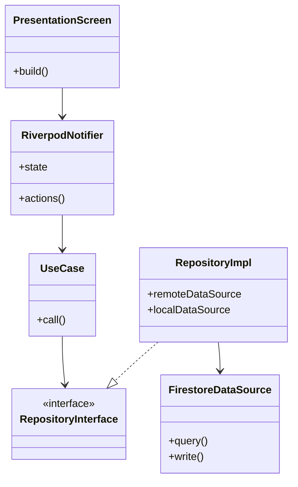
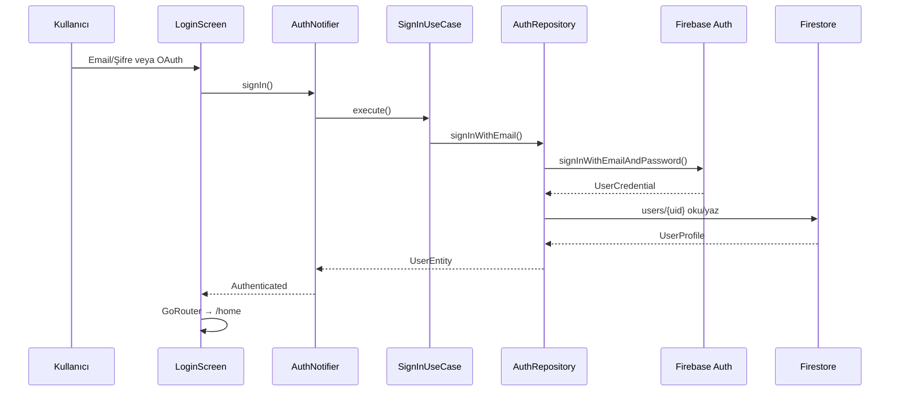
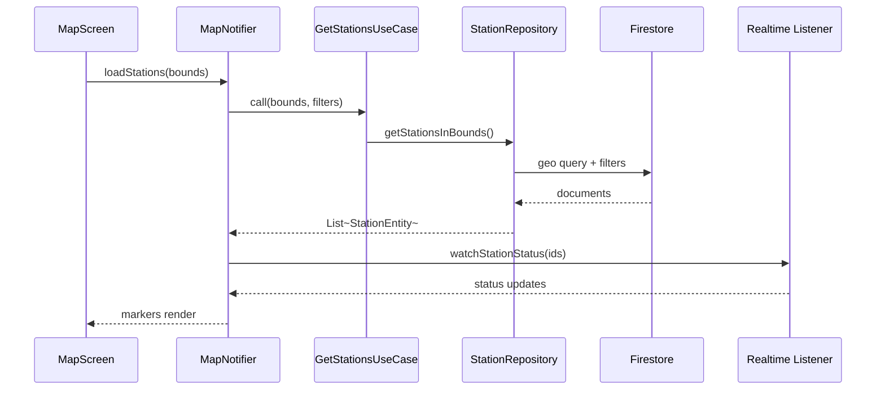

# EV Navigator — Sistem Mimarisi

## 1. Genel Bakış

EV Navigator, **Clean Architecture** + **Riverpod** + **Firebase** üzerine kurulu, Türkiye odaklı elektrikli araç süper uygulamasıdır.

```
┌─────────────────────────────────────────────────────────────┐
│                    PRESENTATION LAYER                        │
│  Screens · Widgets · Riverpod Providers/Notifiers            │
├─────────────────────────────────────────────────────────────┤
│                      DOMAIN LAYER                            │
│  Entities · Repository Interfaces · Use Cases                │
├─────────────────────────────────────────────────────────────┤
│                       DATA LAYER                             │
│  Firestore/REST DataSources · DTOs · Repository Impl       │
├─────────────────────────────────────────────────────────────┤
│                       CORE LAYER                             │
│  Theme · Router · Dio · Hive · FCM · Secure Storage          │
└─────────────────────────────────────────────────────────────┘
```

## 2. UML — Katman Diyagramı



## 3. UML — Auth Akışı



## 4. UML — Harita Veri Akışı



## 5. Ekran Listesi

| Route | Ekran | Modül |
|-------|-------|-------|
| `/splash` | SplashScreen | core |
| `/login` | LoginScreen | auth |
| `/register` | RegisterScreen | auth |
| `/forgot-password` | ForgotPasswordScreen | auth |
| `/verify-email` | EmailVerificationScreen | auth |
| `/complete-profile` | ProfileCompletionScreen | auth |
| `/home` | HomeDashboardScreen | home |
| `/map` | MapScreen | map |
| `/map/station/:id` | StationDetailScreen | map |
| `/planner` | TripPlannerScreen | trip_planner |
| `/planner/result` | TripResultScreen | trip_planner |
| `/battery` | BatteryHealthScreen | battery |
| `/cost` | CostCalculatorScreen | cost |
| `/service` | ServiceMapScreen | service |
| `/service/:id` | ServiceDetailScreen | service |
| `/community` | CommunityFeedScreen | community |
| `/community/post/:id` | PostDetailScreen | community |
| `/community/create` | CreatePostScreen | community |
| `/profile` | ProfileScreen | profile |
| `/profile/vehicles` | VehicleManagementScreen | profile |
| `/notifications` | NotificationsScreen | profile |
| `/settings` | SettingsScreen | profile |

## 6. Kullanıcı Akışları

### 6.1 İlk Açılış
Splash → Auth durumu kontrol → Login veya Home

### 6.2 Kayıt
Register → Email doğrulama → Profil tamamlama → Araç ekleme → Home

### 6.3 Şarj Bulma
Home → Harita → Filtre → İstasyon detay → Favori / Yol tarifi

### 6.4 Uzun Yol
Planner → Başlangıç/Bitiş/Araç/SOC → Hesapla → Şarj durakları → Navigasyon

## 7. Paket Listesi

| Paket | Amaç |
|-------|------|
| flutter_riverpod | State management |
| riverpod_annotation | Code gen providers |
| go_router | Declarative routing |
| freezed + json_serializable | Immutable models |
| firebase_core/auth/firestore/storage/messaging | Backend |
| google_maps_flutter | Harita |
| google_maps_cluster_manager | Marker clustering |
| dio | HTTP (Directions API) |
| hive_flutter | Offline cache |
| flutter_secure_storage | Token/API key |
| google_sign_in / sign_in_with_apple | OAuth |
| fl_chart | Grafikler |
| cached_network_image | Görsel cache |
| shimmer | Skeleton loading |
| geolocator | Konum |
| image_picker | Topluluk fotoğraf |
| connectivity_plus | Offline detection |
| build_runner | Code generation |

## 8. Güvenlik

- Firestore Security Rules (RBAC: user, admin)
- API anahtarları: `--dart-define` + Secure Storage
- Input validation: domain validators
- Rate limiting: Cloud Functions (rules doc'ta tanımlı)

## 9. Admin Panel (Flutter Web)

Ayrı entry: `admin/lib/main.dart`
- Role: `admin` custom claim
- CRUD: stations, news, community moderation, users
